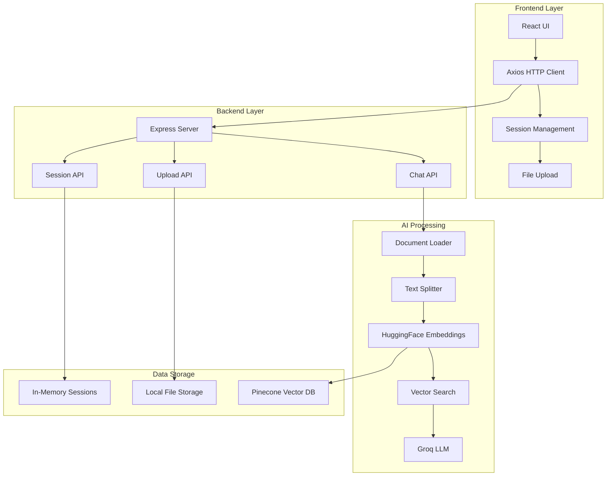
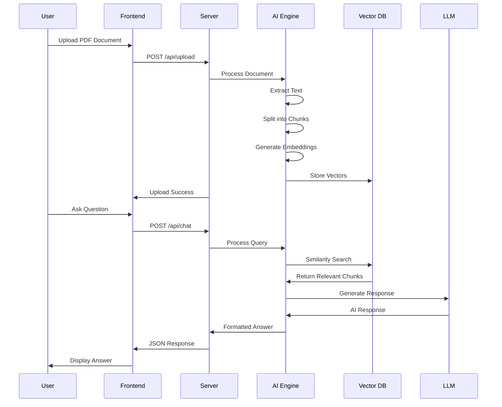

# 🌟 DOCCHAT - Intelligent Document Assistant

<div align="center">


[](https://reactjs.org/)
[](https://nodejs.org/)
[](https://langchain.com/)
[](https://groq.com/)
[](https://pinecone.io/)

**🚀 Chat with your PDF documents using cutting-edge AI technology**

*Transform any PDF into an interactive conversation partner*

</div>

---

## 📋 Table of Contents

- [✨ Features](#-features)
- [🏗️ Architecture](#️-architecture)
- [🤖 AI Workflow](#-ai-workflow)
- [🛠️ Tech Stack](#️-tech-stack)
- [📁 Project Structure](#-project-structure)
- [⚡ Quick Start](#-quick-start)
- [🔧 Configuration](#-configuration)
- [📖 Usage Guide](#-usage-guide)
- [🔗 API Reference](#-api-reference)
- [🎨 UI Features](#-ui-features)
- [🤝 Contributing](#-contributing)

---

## ✨ Features

### 🎯 Core Functionality
- **📄 PDF Document Upload** - Support for PDF files up to 10MB
- **💬 Intelligent Chat Interface** - Natural language conversations with documents
- **🔍 Smart Document Search** - RAG-powered retrieval for accurate responses
- **📚 Multiple Document Support** - Switch between default and uploaded documents
- **💾 Session Management** - Persistent chat history with automatic session creation
- **🎨 Beautiful UI** - Modern, responsive design with rose/pink theme

### 🚀 Advanced Features
- **⚡ Real-time Responses** - Fast AI-powered answers using Groq LLM
- **📱 Fully Responsive** - Optimized for desktop, tablet, and mobile devices
- **🎭 Session History** - Browse and manage previous conversations
- **🔄 Document Switching** - Seamless transition between different documents
- **✅ Upload Feedback** - Beautiful confirmation when documents are processed
- **🎪 Loading States** - Elegant loading indicators and animations

### 🛡️ Enterprise Ready
- **🔒 Secure File Handling** - Automatic cleanup after processing
- **⚠️ Error Management** - Comprehensive error handling and user feedback
- **🏃‍♂️ Performance Optimized** - Efficient chunking and vector search
- **📊 Memory Management** - Smart storage for uploaded vs default documents

---

## 🏗️ Architecture



---

## 🤖 AI Workflow

### 🔄 RAG (Retrieval Augmented Generation) Pipeline



### 🧠 AI Components Breakdown

1. **📄 Document Processing**
   - PDF text extraction using LangChain PDFLoader
   - Recursive character text splitting (500 tokens, 100 overlap)
   - Metadata preservation for source tracking

2. **🔍 Embedding Generation**
   - HuggingFace Transformers: `Xenova/all-MiniLM-L6-v2`
   - Local processing for privacy and speed
   - 384-dimensional vector embeddings

3. **🗃️ Vector Storage**
   - **Default Documents**: Pinecone cloud vector database
   - **Uploaded Documents**: In-memory storage with similarity search
   - Hybrid approach for optimal performance

4. **🤖 LLM Integration**
   - **Model**: Llama-3.3-70b-versatile (via Groq)
   - **Context Window**: Optimized for document chunks
   - **Response Style**: Concise, direct, and contextual

---

## 🛠️ Tech Stack

### Frontend 🎨
- **⚛️ React 19.2.0** - Modern UI library with latest features
- **🎨 Tailwind CSS 4.2.0** - Utility-first styling framework  
- **⚡ Vite 7.3.1** - Fast build tool and dev server
- **🔗 Axios 1.6.7** - Promise-based HTTP client
- **🎭 React Icons 5.5.0** - Beautiful icon library
- **📱 Responsive Design** - Mobile-first approach

### Backend 🖥️
- **🟢 Node.js** - JavaScript runtime environment
- **📦 Express 4.18.2** - Web application framework
- **🔗 CORS 2.8.5** - Cross-origin resource sharing
- **📁 Multer 1.4.4** - File upload middleware
- **📄 PDF-Parse 1.1.4** - PDF text extraction

### AI & Machine Learning 🤖
- **🦜 LangChain 1.2.25** - LLM application framework
- **🤗 HuggingFace Transformers 3.8.1** - ML model library
- **⚡ Groq SDK 0.37.0** - Ultra-fast LLM inference
- **🌲 Pinecone** - Production-ready vector database
- **🔧 Xenova Transformers 2.17.2** - Browser-compatible ML

### Development Tools 🔧
- **📋 ESLint** - Code linting and formatting
- **🔒 dotenv** - Environment variable management
- **🔄 Hot Reload** - Development productivity features

---

## 📁 Project Structure

```
DOCCHAT/
├── 📁 frontend/                 # React frontend application
│   ├── 📁 src/
│   │   ├── 📄 App.jsx          # Main application component
│   │   ├── 📄 main.jsx         # Application entry point
│   │   └── 📄 index.css        # Global styles
│   ├── 📄 package.json         # Frontend dependencies
│   ├── 📄 vite.config.js       # Vite configuration
│   └── 📄 tailwind.config.js   # Tailwind CSS config
│
├── 📁 server/                   # Node.js backend server
│   ├── 📄 server.js            # Express server & API routes
│   ├── 📄 chatbot.js           # AI chat logic & Groq integration
│   ├── 📄 prepare.js           # Document processing & RAG
│   ├── 📄 rag.js               # RAG initialization script
│   ├── 📄 package.json         # Backend dependencies
│   ├── 📄 .env                 # Environment variables
│   └── 📁 uploads/             # Temporary file storage
│
└── 📄 README.md                # This comprehensive guide
```

---

## ⚡ Quick Start

### 🔧 Prerequisites

- **Node.js** 18+ installed
- **npm** or **yarn** package manager
- **Groq API Key** for LLM access
- **Pinecone Account** for vector storage (optional)

### 🚀 Installation

1. **📥 Clone the repository**
   ```bash
   git clone https://github.com/yourusername/docchat.git
   cd DOCCHAT
   ```

2. **🖥️ Setup Backend**
   ```bash
   cd server
   npm install
   ```

3. **🎨 Setup Frontend**
   ```bash
   cd ../frontend
   npm install
   ```

### 🔑 Environment Setup

Create a `.env` file in the `server` directory:

```env
# Required - Groq API for LLM inference
GROQ_API_KEY=your_groq_api_key_here

# Optional - Pinecone for default documents
PINECONE_API_KEY=your_pinecone_api_key_here
PINECONE_INDEX_NAME=your_index_name

# Optional - OpenAI (if using OpenAI instead of Groq)
OPENAI_API_KEY=your_openai_api_key_here

# Server Configuration
PORT=3001
```

### 🏃‍♂️ Running the Application

1. **🖥️ Start the backend server**
   ```bash
   cd server
   npm start
   # Server runs on http://localhost:3001
   ```

2. **🎨 Start the frontend** (in a new terminal)
   ```bash
   cd frontend
   npm run dev
   # Frontend runs on http://localhost:5173
   ```

3. **🌐 Open your browser**
   Navigate to `http://localhost:5173`

---

## 🔧 Configuration

### 🔑 API Keys Setup

#### Groq API Key (Required)
1. Visit [Groq Console](https://console.groq.com/)
2. Create an account and generate an API key
3. Add to `.env` file: `GROQ_API_KEY=your_key_here`

#### Pinecone Setup (Optional - for default documents)
1. Create account at [Pinecone](https://pinecone.io/)
2. Create a new index with dimensions: 384
3. Add credentials to `.env` file

### ⚙️ Environment Variables

| Variable | Required | Description |
|----------|----------|-------------|
| `GROQ_API_KEY` | ✅ | Groq API key for LLM inference |
| `PINECONE_API_KEY` | ❌ | Pinecone API key for vector storage |
| `PINECONE_INDEX_NAME` | ❌ | Name of your Pinecone index |
| `OPENAI_API_KEY` | ❌ | Alternative to Groq (not currently used) |
| `PORT` | ❌ | Server port (default: 3001) |

---

## 📖 Usage Guide

### 📄 Uploading Documents

1. **📤 Click the Upload Button** - Located in the bottom-left of the chat interface
2. **📁 Select PDF File** - Choose any PDF document (max 10MB)
3. **⏱️ Wait for Processing** - Document will be automatically processed and indexed
4. **✅ Confirmation** - Beautiful success message appears when ready
5. **💬 Start Chatting** - Ask questions about your document content

### 💬 Chatting with Documents

- **📝 Type Questions** - Natural language queries work best
- **🔍 Specific Queries** - Ask about specific topics, sections, or details
- **📊 Request Summaries** - Ask for summaries or key points
- **❓ Follow-up Questions** - Build on previous responses

### 🗂️ Managing Sessions

- **➕ Create New Session** - Click "New Conversation" button
- **📋 View History** - Click the menu icon to see past conversations
- **🗑️ Delete Sessions** - Hover over sessions to see delete option
- **🔄 Switch Sessions** - Click any session to load its conversation

### 📱 Mobile Usage

- **👆 Touch-Friendly** - Optimized buttons and touch targets
- **📲 Responsive Layout** - Adapts to any screen size
- **🔄 Gesture Support** - Intuitive mobile interactions

---

## 🔗 API Reference

### 📡 Chat Endpoints

#### POST `/api/chat`
**Send a message and get AI response**

```json
// Request
{
  "message": "What is the main topic of this document?",
  "sessionId": "session_1" // optional
}

// Response
{
  "response": "The document discusses...",
  "sessionId": "session_1"
}
```

#### POST `/api/upload`
**Upload and process PDF document**

```bash
curl -X POST \
  -F "pdf=@document.pdf" \
  http://localhost:3001/api/upload
```

### 📊 Session Management

#### GET `/api/sessions`
**Get all chat sessions**

```json
// Response
[
  {
    "id": "session_1",
    "title": "Chat about company policies",
    "createdAt": "2026-02-19T10:30:00Z",
    "messageCount": 5
  }
]
```

#### GET `/api/sessions/:sessionId`
**Get specific session with messages**

#### DELETE `/api/sessions/:sessionId`
**Delete a session**

#### POST `/api/sessions`
**Create new session**

### 🔍 Health Check

#### GET `/api/health`
**Check server status**

```json
// Response
{
  "status": "Server is running!"
}
```

---

## 🎨 UI Features

### 🌈 Design System

- **🎨 Color Scheme**: Rose/Pink gradient theme with white background
- **📱 Responsive Design**: Mobile-first approach with breakpoints
- **🎭 Icons**: React Icons library for consistent iconography
- **⚡ Animations**: Subtle transitions and loading states
- **🎪 Components**: Reusable, accessible UI components

### 🖥️ Layout Components

#### 📋 Header
- **👑 Brand icon** with crown symbol
- **📄 Document status** indicator
- **📤 Upload button** (moved to input area)
- **📱 Mobile hamburger** menu

#### 💬 Chat Interface
- **👤 User messages** - Rose gradient bubbles (right-aligned)
- **🤖 Bot responses** - White bubbles with borders (left-aligned)
- **📄 Document uploads** - Special highlighted cards
- **⏳ Loading states** - Elegant thinking indicators

#### 📱 Input Area (Fixed Bottom)
- **📤 Upload button** - Icon-only with tooltip
- **💭 Message input** - Auto-expanding text area
- **📨 Send button** - Gradient style matching theme

#### 🗂️ Sidebar (Chat History)
- **➕ New conversation** button
- **📋 Session list** with metadata
- **🗑️ Delete actions** on hover
- **📱 Overlay on mobile** devices

---

## 🤝 Contributing

We welcome contributions! Here's how you can help:

### 🛠️ Development Setup

1. **🍴 Fork the repository**
2. **🌿 Create a feature branch**: `git checkout -b feature/amazing-feature`
3. **💻 Make your changes**
4. **✅ Test thoroughly**
5. **📝 Commit changes**: `git commit -m 'Add amazing feature'`
6. **🚀 Push to branch**: `git push origin feature/amazing-feature`
7. **📬 Open a Pull Request**

### 🎯 Areas for Contribution

- 🐛 **Bug Fixes** - Help us identify and fix issues
- ✨ **New Features** - Add new functionality
- 📚 **Documentation** - Improve guides and examples
- 🎨 **UI/UX** - Enhance the user interface
- 🔧 **Performance** - Optimize speed and efficiency
- 🧪 **Testing** - Add test coverage
- 🌐 **Internationalization** - Add language support

### 📋 Code Standards

- **📏 ESLint** configuration for code quality
- **🎨 Prettier** for consistent formatting
- **📝 Meaningful** commit messages
- **📖 Comment** complex logic
- **🧪 Test** new features

---

## 📜 License

This project is licensed under the MIT License - see the [LICENSE](LICENSE) file for details.

---

## 🙏 Acknowledgments

- **🦜 LangChain** - For the amazing RAG framework
- **⚡ Groq** - For ultra-fast LLM inference
- **🤗 HuggingFace** - For open-source ML models
- **🌲 Pinecone** - For scalable vector database
- **⚛️ React Team** - For the incredible UI library
- **🎨 Tailwind** - For the utility-first CSS framework

---

<div align="center">

**🌟 Star this project if you find it helpful! 🌟**

Made with ❤️ by [Your Name](https://github.com/yourusername)

[](https://github.com/yourusername/docchat/stargazers)
[](https://github.com/yourusername/docchat/network)

</div>

---

## 🚀 What's Next?

### 🔮 Upcoming Features
- 🌐 **Multi-language Support** - International accessibility
- 🔊 **Voice Interface** - Speech-to-text and text-to-speech
- 📊 **Advanced Analytics** - Usage insights and metrics
- 🔗 **API Integrations** - Connect with external services
- 🧠 **Memory Enhancement** - Long-term conversation memory
- 📁 **Batch Processing** - Multiple document uploads
- 🎯 **Smart Suggestions** - AI-powered question recommendations

### 💡 Ideas & Feedback

Have ideas for improvement? Found a bug? We'd love to hear from you!

- 🐛 [Report a Bug](https://github.com/yourusername/docchat/issues/new?template=bug_report.md)
- 💡 [Request a Feature](https://github.com/yourusername/docchat/issues/new?template=feature_request.md)
- 💬 [Join Discussions](https://github.com/yourusername/docchat/discussions)

---

*Happy chatting with your documents! 🎉📄💬*